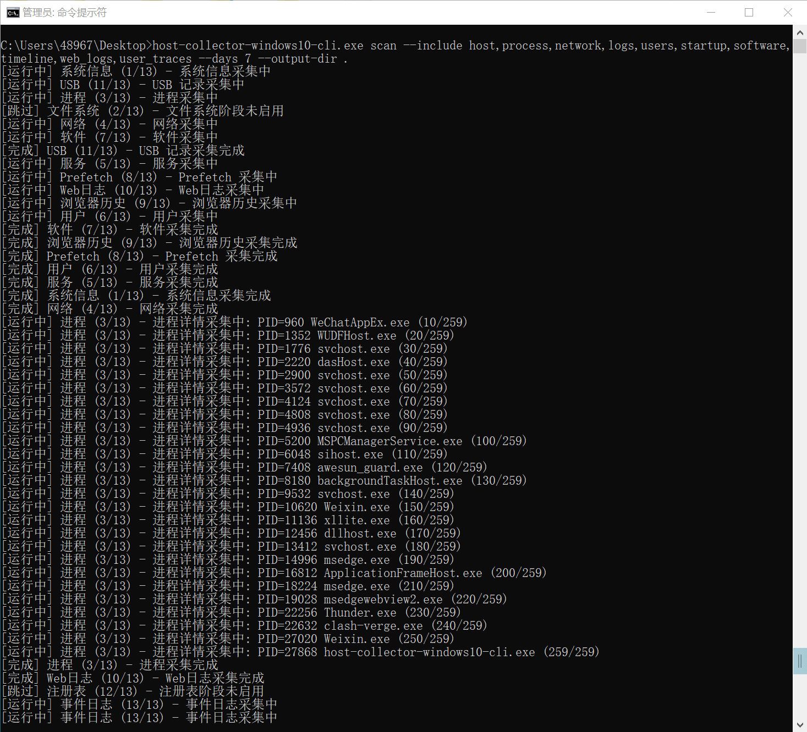
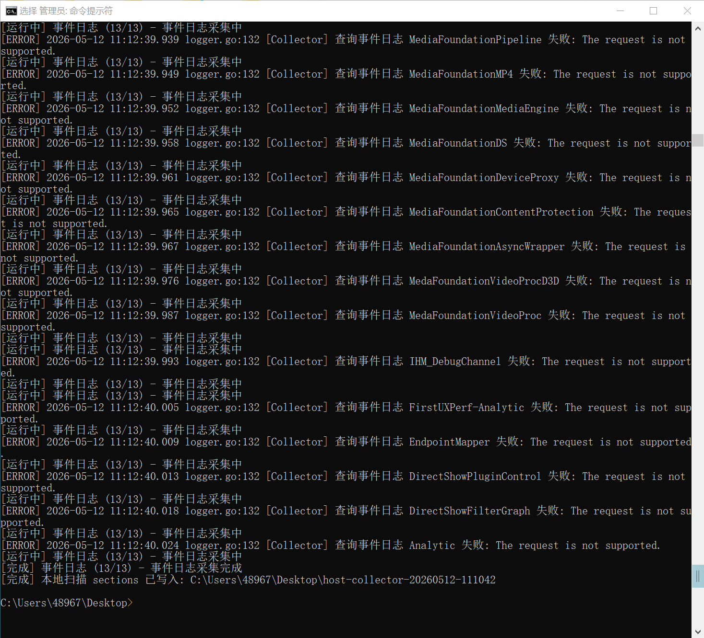
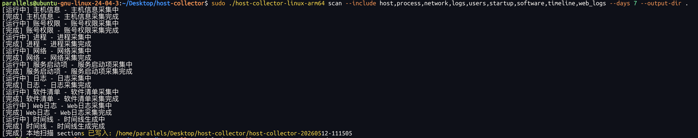
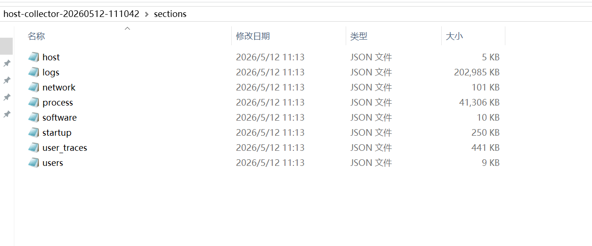

# Host Collector Local CLI

<p dir="auto">🌐 <a href="README.zh-CN.md">中文简体</a> | <a href="README.md">English</a></p>

Host Collector Local CLI collects host investigation evidence and writes a local JSON directory. It is designed for local review, offline handoff, and repeatable evidence inspection.

## Artifacts

| Artifact | Use on |
|---|---|
| `host-collector-windows7-cli.exe` | Windows 7, Windows 8, Windows 8.1, Windows Server 2008 R2, Windows Server 2012, Windows Server 2012 R2 |
| `host-collector-windows10-cli.exe` | Windows 10, Windows 11, Windows Server 2016, Windows Server 2019, Windows Server 2022, and newer Windows Server releases |
| `host-collector-linux-amd64` | Linux x86_64 / amd64 |
| `host-collector-linux-arm64` | Linux arm64 / aarch64 |

Windows rule of thumb: systems before the Windows 10 / Server 2016 generation use the Windows 7 compatible artifact; Windows 10 / Server 2016 and newer use the Windows 10 artifact.

Local build:

```bash
scripts/oss/build_cli.sh
```

## Usage

Run Windows artifacts from an Administrator Command Prompt or elevated PowerShell. Run Linux artifacts with `sudo` or as `root`; low-privilege runs are rejected because host investigation sources require elevated access.

```bash
host-collector scan --include host,process,network,logs,users,startup,software,timeline,web_logs,user_traces --days 7 --output-dir ./out
```

| Flag | Description |
|---|---|
| `--include` | Comma-separated domains to collect |
| `--exclude` | Domains removed after include resolution |
| `--days` | `7`, `14`, or `30`; applies to time-window-aware evidence |
| `--output-dir` | Output directory |

When `--output-dir` is `.` or `./`, the CLI creates a scan-specific subdirectory under the current directory, for example `host-collector-20260512-101530`, and writes the JSON directory there.

## Examples

On Windows, an elevated Command Prompt prints the current collection stage, stage number, and detailed progress so you can see that collection is still moving.



Windows event log collection enumerates readable event channels. Some channels may be unsupported on the current system; those failures are printed with the channel name while other channels and domains continue.



The Linux arm64 artifact can run directly on a Linux ARM64 environment with `sudo`. This example collects host, process, network, log, user, startup, software, timeline, and web log domains, then writes a scan-specific output directory.



The output layout uses stable per-domain section files. Each selected domain writes an independent JSON file, which makes large evidence sets easier to process with scripts.



Common include values:

```bash
# All common local section domains, including user trace evidence.
--include host,process,network,logs,users,startup,software,timeline,web_logs,user_traces

# Add heavy forensic domains: Windows registry and Windows/Linux filesystem.
--include host,process,network,logs,users,startup,software,timeline,web_logs,user_traces,registry,file_system

# Small triage scan.
--include host,process,network

# Time-window-heavy scan.
--include logs,startup,timeline,web_logs,user_traces --days 30

# Exclude a large domain after selecting a broad set.
--include host,process,network,logs,users,startup,software,timeline,web_logs,user_traces --exclude web_logs
```

## Output Layout

```text
out/
  manifest.json
  sections/
    host.json
    process.json
    network.json
    logs.json
    users.json
    startup.json
    software.json
    timeline.json
    web_logs.json
    user_traces.json
    registry.json
    file_system.json
```

`manifest.json` records metadata, command-line options, and the section file for each selected domain. All collected evidence lives under `sections/`.

## Highlights

- Domain-based output: results are split into `host`, `process`, `network`, `logs`, `users`, `startup`, `software`, `timeline`, `web_logs`, `user_traces`, `registry`, `file_system`, and other selected domains instead of one large combined file.
- Controlled scope: `--include` is an allowlist, so omitted domains are not collected; `--exclude` removes domains after broad selection; `--days` limits evidence sources that support time windows, such as logs, web logs, user traces, and timelines.
- Shadow account inference: the Windows user domain correlates NetAPI, WMI, `net user`, SAM registry evidence, session traces, and local group membership. It flags shadow-account state, confidence, reason codes, and evidence when an account appears only in SAM, SAM RID keys and Names indexes disagree, API/WMI/command visibility conflicts, multiple accounts share SAM `F`/`V` data digests, or a non-built-in account appears in an administrator alias group.
- Middleware log path inference: the web log domain first identifies IIS, Nginx, Apache, and Tomcat runtime signals from process names, command lines, image paths, and listening ports. It then reads configuration hints such as IIS site log directories, Nginx `access_log` and `include`, Apache `CustomLog`, and Tomcat access log Valve settings before fingerprinting and parsing candidate log files.
- Windows investigation coverage: event logs, process details, network connections, Prefetch, browser history, USB records, services, scheduled tasks, registry persistence, and NTFS/filesystem evidence. The filesystem domain keeps volume facts, directory nodes, file timestamps, hash state, deleted/orphaned evidence, and collection diagnostics where available.
- Linux investigation coverage: `/proc` process and network evidence, `/etc/passwd` and `/etc/group` accounts, sudo/admin privilege clues, systemd units and timers, cron, package inventories, auth/system logs, shell history, web middleware logs, POSIX permissions, inode data, symlinks, and setuid/setgid/sticky/world-writable filesystem evidence.
- Raw evidence first: inferred fields keep source, reason, or evidence markers so the original JSON can be reviewed later. Missing fields usually mean the platform lacks that source, permissions were insufficient, files were unreadable, or the domain was not selected with `--include`.

## Downstream Analysis Project Ideas

The CLI output is raw, domain-split evidence. The following ideas describe optional downstream projects that can read `manifest.json` and `sections/*.json`; they are not required for collection and are not built into the CLI binary.

### IP, Domain, URL, And Hash Enrichment

Build a standalone enrichment pipeline that extracts observables from:

- `sections/network.json`: remote IPs, listening ports, DNS cache/resolver evidence, process-to-connection links.
- `sections/web_logs.json`: client IPs, host headers, request URLs, user agents, status codes, referrers, suspicious paths.
- `sections/logs.json`: Windows event messages, Linux auth/syslog messages, firewall or service logs.
- `sections/process.json`: command-line URLs, suspicious domains, downloaded file paths, executable hashes when available.
- `sections/user_traces.json`: browser history URLs and shell-history network commands, after sensitive values are redacted.

Recommended flow:

1. Normalize observables into a table such as `observable`, `type`, `sourceDomain`, `sourceFile`, `recordId`, `firstSeen`, `lastSeen`, `processId`, and `host`.
2. Split private/internal addresses from public Internet addresses. Keep internal IPs for graph reasoning, but avoid sending them to third-party services by default.
3. Use [ip2region](https://github.com/lionsoul2014/ip2region) as an offline IP region and ISP lookup library for public or internal-range-labeled addresses. This should live in a separate enrichment script or service, not as a collector argument.
4. For public IPs, domains, URLs, or hashes, optionally query threat intelligence sources such as [URLhaus](https://urlhaus.abuse.ch/), [MalwareBazaar](https://bazaar.abuse.ch/), [AlienVault OTX](https://otx.alienvault.com/), [AbuseIPDB](https://www.abuseipdb.com/), [ThreatMiner](https://www.threatminer.org/), [GreyNoise Community](https://viz.greynoise.io/), [VirusTotal](https://www.virustotal.com/), and [IBM X-Force Exchange](https://exchange.xforce.ibmcloud.com/).
5. Respect API keys, rate limits, terms of use, and privacy boundaries. Do not upload full raw logs or private host data when a query only needs one IP, domain, URL, or hash.
6. Write analyst-owned outputs such as `analysis/observables.json`, `analysis/ip_region.json`, `analysis/threat_intel_hits.json`, and `analysis/network_findings.json`.

Useful finding anchors include Internet-facing listeners, rare countries or ISPs for the environment, outbound connections from service accounts, web requests from known scanners, URLs reported by URLhaus, malware hashes reported by MalwareBazaar or VirusTotal, AbuseIPDB abuse confidence hits, OTX pulse matches, GreyNoise scanner classifications, and X-Force risk categories.

### Windows System Binary Masquerade And Hash Reputation

Windows investigations should treat system-binary lookalikes and replaced executables as first-class analysis targets. Common examples include `svhost.exe`, `scvhost.exe`, `svch0st.exe`, `lsasss.exe`, `explore.exe`, `csrss.exe`, `rundl132.exe`, or a real-looking `svchost.exe` copied outside trusted Windows directories.

Suggested checks:

- Compare process and file paths against trusted locations. For example, legitimate `svchost.exe` is normally under `%SystemRoot%\System32\` or `%SystemRoot%\SysWOW64\`; a same-name binary under a user profile, temp directory, web root, service upload directory, or writable application directory is suspicious.
- Compare file names with fuzzy or typo-style rules: `svhost.exe` vs `svchost.exe`, `scvhost.exe` vs `svchost.exe`, `explore.exe` vs `explorer.exe`, `rundl132.exe` vs `rundll32.exe`.
- Prefer SHA-256 for internal identity, but also keep MD5 and SHA-1 when available because many reputation systems still accept them. Query hashes in VirusTotal, MalwareBazaar, IBM X-Force, OTX, or other approved intelligence sources.
- Join hashes with process evidence, service `binaryPath`, scheduled task commands, registry autorun values, Prefetch execution traces, web upload paths, and filesystem timestamps.
- Check Authenticode signature state, signer name, PE company name, original file name, version info, compile timestamp, file size, and whether metadata conflicts with the path or process name.
- Flag suspicious parent-child chains such as web middleware -> `cmd.exe`/`powershell.exe` -> renamed system binary, Office/script host -> downloader -> service install, or `rundll32.exe`/`regsvr32.exe` loading DLLs from writable directories.
- Treat network activity from renamed system binaries as a high-priority pivot: connect the process to remote IP/domain enrichment, DNS evidence, threat-intelligence hits, and timeline events.

Other useful Windows pivots include LOLBins such as `powershell.exe`, `cmd.exe`, `wscript.exe`, `cscript.exe`, `mshta.exe`, `certutil.exe`, `bitsadmin.exe`, `rundll32.exe`, `regsvr32.exe`, `wmic.exe`, and `schtasks.exe`; suspicious service DLL paths; unsigned drivers; new executables under startup folders; and executable files created shortly before account, service, task, or outbound-network events.

### Sigma-Based Log And Vulnerability Detection

Web logs, Windows event logs, and Linux logs can be converted into normalized event objects and evaluated with [Sigma](https://github.com/SigmaHQ/sigma) rules or an equivalent rule engine.

Suggested mapping:

- Windows logs: map `windowsEventLogs[].channel`, `eventId`, `provider`, `timestamp`, `message`, `user`, `process`, and `ip` fields into Sigma-compatible event objects. Useful detections include account creation, administrator group changes, service installation, scheduled task creation, PowerShell execution, remote logon, log clearing, security tool tampering, and suspicious process chains.
- Linux logs: map `linuxLogEvents[]`, auth logs, sudo events, SSH failures/successes, cron/systemd messages, package installation records, and shell-history-derived events. Useful detections include brute force, new sudo-capable users, UID 0 anomalies, unexpected authorized keys, cron persistence, systemd persistence, suspicious `curl|wget|bash` patterns, and service restarts after file changes.
- Web logs: map `webLogEntries[].clientIp`, `method`, `uri`, `status`, `userAgent`, `referrer`, `bytesSent`, and middleware source. Useful detections include exploit probes, directory traversal, webshell paths, suspicious upload endpoints, scanner user agents, SQL injection/XSS payloads, abnormal 4xx/5xx bursts, admin path access, and requests followed by suspicious process or file activity.
- Basic vulnerability checks: combine `software`, `process`, `web_logs`, `startup`, and `file_system` evidence to flag risky middleware versions, exposed admin consoles, weak service paths, world-writable executable directories, setuid/setgid risk files, suspicious startup binaries, and unsafe script interpreters reachable by web services.

Rule hits should keep the original domain, source path, record ID, timestamp, rule ID, severity, matched fields, and a short reason. That makes every alert traceable back to the raw section JSON.

### Shadow Account And Privilege Anchors

Account and privilege anomalies should be treated as high-value anchors for investigation.

Windows anchor examples:

- An account appears in SAM evidence but is absent from NetAPI, WMI, or `net user` views.
- SAM RID keys and `Names` indexes disagree.
- Two accounts share suspicious SAM `F` or `V` data digests.
- A non-built-in account is present in local Administrators or another privileged alias group.
- A new account, group membership change, remote logon, scheduled task, service install, or suspicious executable appears close together in the timeline.

Linux anchor examples:

- A non-root username has UID `0`.
- A user appears in sudo/admin/wheel groups without expected ownership or change history.
- Unexpected `authorized_keys`, shell startup files, cron entries, systemd units, or writable service paths appear in user or filesystem evidence.
- A service account starts an interactive shell, runs network download commands, or owns suspicious persistence files.

These anchors can be joined with log, process, network, startup, registry, and filesystem evidence to produce an analyst review queue.

### Graph Database And Attack Route Reasoning

For larger evidence sets, load normalized records into a graph database such as [Neo4j](https://neo4j.com/) or another property graph engine. The graph layer should preserve raw record IDs so every node and edge can be traced back to `sections/*.json`.

Useful node types:

- `Host`, `User`, `Group`, `Process`, `File`, `Service`, `ScheduledTask`, `RegistryKey`, `NetworkEndpoint`, `Domain`, `URL`, `LogEvent`, `WebRequest`, `Software`, `Finding`, and `ThreatIntelHit`.

Useful edge types:

- `MEMBER_OF`, `OWNS_PROCESS`, `SPAWNED`, `EXECUTES_FILE`, `LISTENS_ON`, `CONNECTED_TO`, `RESOLVES_TO`, `REQUESTED_URL`, `REFERENCES_FILE`, `PERSISTS_VIA`, `OBSERVED_IN_LOG`, `MATCHED_RULE`, `HAS_THREAT_INTEL`, and `OCCURRED_NEAR`.

Dangerous findings become graph anchors: threat-intelligence hits, Sigma rule hits, shadow-account signals, suspicious startup items, risky file permissions, web exploit requests, malware hashes, and abnormal outbound connections. From those anchors, the graph can infer likely attack routes, for example:

- Web exploit request -> middleware process -> webshell-like file -> child command shell -> outbound suspicious IP.
- New privileged account -> remote logon event -> scheduled task -> executable in writable directory -> persistence finding.
- Suspicious domain in process command line -> DNS evidence -> remote IP region/threat hit -> process tree -> parent service.
- World-writable service path -> replaced executable evidence -> service restart log -> outbound connection.

The graph project can output `analysis/attack_paths.json`, `analysis/finding_graph.json`, or a separate database export. The collector itself should remain focused on evidence collection; enrichment, rule matching, and graph reasoning can evolve independently.

## Domains

Domain names are the values passed to `--include` and `--exclude`. `--include` is the allowlist: a domain that is not listed is not collected and does not write `sections/<domain>.json`. `--exclude` removes domains after include resolution.

Windows Prefetch, browser history, USB records, and Linux shell history are collected only when `user_traces` is listed. Heavy forensic domains are also opt-in: Windows registry collection requires `registry`, and Windows/Linux filesystem forensics require `file_system`. When enabled, these domains write `sections/user_traces.json`, `sections/registry.json`, or `sections/file_system.json`; if the target machine has no matching rows, explicitly selected heavy or trace domains still use stable empty-array structures so scripts can consume them predictably.

### Common Domains

| Include value | Section file | JSON keys | Windows | Linux | What it collects |
|---|---|---|---|---|---|
| `host` | `sections/host.json` | `system`, `resources`, `hardware`, `platformFacts` | yes | yes | Hostname, OS version, architecture, CPU, memory, disk, boot/session facts, platform capability facts |
| `process` | `sections/process.json` | `processes`, `processDetails`, `processTree`, `fileIdentities` | yes | yes | Process list, parent/child relations, command lines, executable identity, executable hash/path metadata when available |
| `network` | `sections/network.json` | `network` | yes | yes | Connections, listeners, local/remote endpoints, protocol/state, interfaces, route/DNS/firewall evidence when available |
| `logs` | `sections/logs.json` | `windowsEventLogs`, `linuxLogSources`, `linuxLogEvents` | yes | yes | Windows event log records or Linux log source inventory and parsed auth/system events |
| `users` | `sections/users.json` | `users`, `groups`, `privilegeEvidence` | yes | yes | Local accounts, groups, privilege evidence, login/session related account facts |
| `startup` | `sections/startup.json` | `services`, `timers`, `cronJobs`, `persistenceItems` | yes | yes | Windows services/scheduled tasks and Linux systemd timers, cron jobs, services, persistence indicators |
| `software` | `sections/software.json` | `software` | yes | yes | Installed software, package records, version, vendor/source when available |
| `timeline` | `sections/timeline.json` | `timelineEvents` | yes | yes | Derived event timeline across process, log, startup, network, web log, and file evidence where available |
| `web_logs` | `sections/web_logs.json` | `webLogSources`, `webLogEntries` | yes | yes | IIS/Nginx/Apache/Tomcat style log source discovery and parsed HTTP access records |
| `user_traces` | `sections/user_traces.json` | `prefetch`, `browserHistory`, `usbRecords`, `operationRecords` | yes | yes | Windows Prefetch execution traces, browser history, USB device records, and Linux shell history operation records |
| `registry` | `sections/registry.json` | `registries` | yes | n/a | Windows registry values, persistence, autorun, service, software, and configuration evidence |
| `file_system` | `sections/file_system.json` | `forensicVolumes`, `forensicDirectoryNodes`, `forensicFileEntries`, `forensicTimelineEvents`, `forensicDiagnostics` | yes | yes | Filesystem volumes/mounts, directory nodes, file metadata, deleted/orphaned/permission evidence, file timeline, and collection diagnostics |

### Windows Domain Notes

| Include value | Main Windows sources | Important fields |
|---|---|---|
| `host` | Win32 system APIs, OS version, hardware/resource probes | `system.hostname`, `system.osVersion`, `system.arch`, `resources.cpu`, `resources.memory`, `hardware[]` |
| `process` | Process snapshot APIs, command line probes, executable identity | `processes[].pid`, `processes[].ppid`, `processes[].name`, `processes[].commandLine`, `processTree[]`, `fileIdentities[]` |
| `network` | TCP/UDP tables, adapter/DNS evidence, runtime connection enrichment | `network.connections[]`, `network.listeners[]`, `network.interfaces[]`, `network.dnsCache[]` |
| `logs` | Windows Event Log channels | `windowsEventLogs[].channel`, `windowsEventLogs[].eventId`, `windowsEventLogs[].provider`, `windowsEventLogs[].timestamp` |
| `users` | Local users/groups, SAM/WMI/net session evidence where available | `users[].username`, `users[].sid`, `groups[].name`, `privilegeEvidence[]` |
| `startup` | Services, scheduled tasks, startup folders, persistence records | `services[].name`, `services[].startType`, `services[].binaryPath`, `persistenceItems[]` |
| `software` | Installed software inventory | `software[].name`, `software[].version`, `software[].vendor`, `software[].installLocation` |
| `web_logs` | IIS paths plus Nginx/Apache/Tomcat config/runtime discovery when present | `webLogSources[].serverType`, `webLogSources[].path`, `webLogEntries[].clientIp`, `webLogEntries[].uri` |
| `user_traces` | `C:\Windows\Prefetch`, browser profile history databases when readable, USB registry/device evidence | `prefetch[].processName`, `prefetch[].runCount`, `browserHistory[].url`, `browserHistory[].visitTime`, `usbRecords[].serialNumber` |
| `registry` | Windows registry target set, including Run/RunOnce, Services, Winlogon, IFEO, AppInit, Shell Extensions, scheduled task cache, uninstall records | `registries[].id`, `registries[].path`, `registries[].name`, `registries[].type`, `registries[].data`, `registries[].collectionCategory`, `registries[].riskPurpose` |
| `file_system` | NTFS/filesystem forensics, including volume facts, directory nodes, file records, deleted/orphaned rows, hash state, and timeline rows | `forensicVolumes[]`, `forensicDirectoryNodes[]`, `forensicFileEntries[]`, `forensicTimelineEvents[]`, `forensicDiagnostics` |

### Linux Domain Notes

| Include value | Main Linux sources | Important fields |
|---|---|---|
| `host` | `/proc`, `/sys`, uname, distro release files, filesystem/resource probes | `system.hostname`, `system.os`, `system.kernel`, `resources.cpu`, `resources.memory`, `platformFacts[]` |
| `process` | `/proc/<pid>`, process status, cmdline, exe links | `processes[].pid`, `processes[].ppid`, `processes[].name`, `processes[].commandLine`, `processDetails[]` |
| `network` | `/proc/net`, `ss`/route style evidence, resolver/firewall files when available | `network.connections[]`, `network.listeners[]`, `network.interfaces[]`, `network.routes[]`, `network.dns[]` |
| `logs` | `/var/log`, auth/system logs, journald-compatible parsed events where available | `linuxLogSources[].path`, `linuxLogSources[].kind`, `linuxLogEvents[].eventType`, `linuxLogEvents[].timestamp` |
| `users` | `/etc/passwd`, `/etc/group`, sudo/admin group evidence, login traces | `users[].username`, `users[].uid`, `users[].home`, `groups[].gid`, `privilegeEvidence[]` |
| `startup` | systemd units/timers, cron paths, init/service records | `services[].name`, `services[].unitFile`, `timers[]`, `cronJobs[]`, `persistenceItems[]` |
| `software` | dpkg/rpm/apk/pacman style package inventory when available | `software[].name`, `software[].version`, `software[].source`, `software[].installTime` |
| `web_logs` | Nginx/Apache/Tomcat log discovery and parsed access rows | `webLogSources[].serverType`, `webLogSources[].path`, `webLogEntries[].clientIp`, `webLogEntries[].status` |
| `user_traces` | User shell history files such as `.bash_history` and `.zsh_history`, with secret-like tokens redacted | `operationRecords[].event`, `operationRecords[].operationTime`, `operationRecords[].file`, `operationRecords[].source` |
| `file_system` | Linux filesystem forensics, discovering mounts and collecting POSIX metadata, permissions, inode, symlink, special mode bit, and evidence tag data | `forensicVolumes[]`, `forensicDirectoryNodes[]`, `forensicFileEntries[]`, `forensicTimelineEvents[]`, `forensicDiagnostics[]` |

## Field Dictionary

This dictionary lists the stable field families. Not every platform fills every field. Missing data means the collector could not read that source or the selected domain did not include it.

### Bundle And Manifest Fields

| Field | Type | Meaning |
|---|---|---|
| `metadata.edition` | string | Output edition marker |
| `metadata.run_mode` | string | Run mode recorded by the tool, usually `oss-local` for local JSON directories |
| `metadata.auth_mode` | string | Authentication mode metadata, usually `none` for local JSON directories |
| `metadata.encryption_state` | string | Output encryption state metadata |
| `metadata.collection_scope[]` | string array | Effective domains after `--include` and `--exclude` are resolved |
| `metadata.tool_version` | string | Build or tool version |
| `local_cli.include[]` | string array | Raw domains requested with `--include` |
| `local_cli.exclude[]` | string array | Domains removed with `--exclude` |
| `local_cli.scope[]` | string array | Effective domains actually used |
| `local_cli.days` | number | Time window: `7`, `14`, or `30` |
| `files.sections` | object | Domain name to section path, for example `network -> sections/network.json` |
| `domains.<name>.item_count` | number | Approximate item count for that domain |

### Host Fields

| Field | Type | Meaning |
|---|---|---|
| `system.hostname` | string | Hostname |
| `system.os` | string | Operating system family or distribution |
| `system.osVersion` | string | OS version |
| `system.kernel` | string | Linux kernel or platform kernel string when available |
| `system.arch` | string | CPU architecture such as `amd64` or `arm64` |
| `system.bootTime` | string | Best-effort boot time |
| `resources.cpu` | object | CPU model/count/load facts |
| `resources.memory` | object | Memory total/free/used summary |
| `resources.disk` | object/array | Disk or filesystem capacity summary |
| `hardware[]` | array | Hardware devices or inventory rows when available |
| `platformFacts[]` | array | Capability and platform-detection facts used by the collector |

### Process And File Identity Fields

| Field | Type | Meaning |
|---|---|---|
| `processes[].pid` | number | Process ID |
| `processes[].ppid` | number | Parent process ID |
| `processes[].name` | string | Process name |
| `processes[].commandLine` | string | Command line, truncated or redacted when needed |
| `processes[].user` | string | Process owner when available |
| `processes[].executablePath` | string | Executable path |
| `processDetails[]` | array | Extended process rows such as environment, handles, modules, status, or platform details |
| `processTree[]` | array | Parent-child relationship rows |
| `fileIdentities[].path` | string | File path linked to a process or evidence source |
| `fileIdentities[].sha256` | string | SHA-256 hash when calculated |
| `fileIdentities[].size` | number | File size in bytes |
| `fileIdentities[].modifiedAt` | string | File modification time |
| `fileIdentities[].signature` | object/string | Code signing or package identity evidence when available |

### Network Fields

| Field | Type | Meaning |
|---|---|---|
| `network.connections[]` | array | Active or recently observed connection rows |
| `network.connections[].protocol` | string | TCP, UDP, or platform-specific protocol |
| `network.connections[].localIp` | string | Local IP address |
| `network.connections[].localPort` | number | Local port |
| `network.connections[].remoteIp` | string | Remote IP address |
| `network.connections[].remotePort` | number | Remote port |
| `network.connections[].state` | string | TCP state such as `LISTEN` or `ESTABLISHED` |
| `network.connections[].pid` | number | Owning process ID when available |
| `network.listeners[]` | array | Listening sockets, if split from connections |
| `network.interfaces[]` | array | Network adapters and addresses |
| `network.routes[]` | array | Route table rows when available |
| `network.dns[]` / `network.dnsCache[]` | array | Resolver configuration, DNS cache, or DNS evidence when available |

### Log Fields

| Field | Type | Meaning |
|---|---|---|
| `windowsEventLogs[].channel` | string | Windows event channel |
| `windowsEventLogs[].eventId` | number | Windows event ID |
| `windowsEventLogs[].provider` | string | Event provider |
| `windowsEventLogs[].level` | string/number | Severity level |
| `windowsEventLogs[].timestamp` | string | Event time |
| `windowsEventLogs[].message` | string | Rendered event message or summary |
| `linuxLogSources[].path` | string | Linux log file path |
| `linuxLogSources[].kind` | string | Source type such as auth, syslog, nginx, apache, audit |
| `linuxLogSources[].readable` | boolean | Whether the file was readable |
| `linuxLogEvents[].eventType` | string | Normalized event type |
| `linuxLogEvents[].timestamp` | string | Parsed event time |
| `linuxLogEvents[].sourcePath` | string | Source log file |
| `linuxLogEvents[].message` | string | Parsed or summarized log message |

### Users, Startup, Software, Timeline, And Web Log Fields

| Field | Type | Meaning |
|---|---|---|
| `users[].username` | string | Local username |
| `users[].uid` / `users[].sid` | number/string | Linux UID or Windows SID |
| `users[].home` | string | Home/profile path |
| `users[].shell` | string | Linux shell when available |
| `groups[].name` | string | Group name |
| `groups[].gid` / `groups[].sid` | number/string | Linux GID or Windows SID |
| `privilegeEvidence[]` | array | Sudo/admin/privilege evidence |
| `services[].name` | string | Service or unit name |
| `services[].status` | string | Service status |
| `services[].startType` | string | Startup mode |
| `services[].binaryPath` | string | Service executable path |
| `timers[]` | array | systemd timer records |
| `cronJobs[].schedule` | string | Cron schedule expression |
| `cronJobs[].command` | string | Cron command |
| `persistenceItems[].type` | string | Persistence type |
| `persistenceItems[].path` | string | Path or registry key involved |
| `persistenceItems[].reason` | string | Why the row is relevant |
| `software[].name` | string | Software or package name |
| `software[].version` | string | Version |
| `software[].vendor` | string | Vendor or maintainer |
| `software[].source` | string | Package manager or inventory source |
| `timelineEvents[].timestamp` | string | Event time |
| `timelineEvents[].eventType` | string | Normalized event type |
| `timelineEvents[].sourceDomain` | string | Domain that produced the event |
| `timelineEvents[].summary` | string | Human-readable event summary |
| `webLogSources[].serverType` | string | IIS, nginx, apache, tomcat, or custom |
| `webLogSources[].path` | string | Log file path |
| `webLogSources[].format` | string | Detected log format |
| `webLogEntries[].timestamp` | string | HTTP request time |
| `webLogEntries[].clientIp` | string | HTTP client IP |
| `webLogEntries[].method` | string | HTTP method |
| `webLogEntries[].uri` | string | Request URI |
| `webLogEntries[].status` | number | HTTP status |
| `webLogEntries[].bytesSent` | number | Response size when available |

### User Trace Fields

| Field | Type | Meaning |
|---|---|---|
| `prefetch[].file` | string | Prefetch file name |
| `prefetch[].processName` | string | Process name parsed from the Prefetch file |
| `prefetch[].processPath` | string | Executable path when available |
| `prefetch[].runCount` | number | Parsed execution count when available |
| `prefetch[].lastRunTime` | string | Last run time derived from file metadata or parsed content |
| `prefetch[].exists` | boolean | Whether the referenced Prefetch file still exists |
| `browserHistory[].url` | string | Visited URL |
| `browserHistory[].title` | string | Page title when available |
| `browserHistory[].visitTime` | string | Visit timestamp |
| `browserHistory[].browser` | string | Browser family or profile source |
| `usbRecords[].name` | string | USB device name |
| `usbRecords[].vendor` | string | Vendor text when available |
| `usbRecords[].insertTime` | string | Insert or first-seen time when available |
| `usbRecords[].serialNumber` | string | USB serial number when available |
| `usbRecords[].mountPoint` | string | Drive letter or mount point when available |
| `operationRecords[].event` | string | Operation type, such as `shell_history` |
| `operationRecords[].operationTime` | string | Operation timestamp when the source records one |
| `operationRecords[].file` | string | Command text or file-like evidence value, redacted when needed |
| `operationRecords[].filePath` | string | Source file path, such as a shell history file |
| `operationRecords[].source` | string | User/source label that produced the record |

### Registry And Filesystem Fields

| Field | Type | Meaning |
|---|---|---|
| `registries[].id` | string | Registry value evidence ID |
| `registries[].path` | string | Full registry path |
| `registries[].name` | string | Value name |
| `registries[].type` | string | Registry value type such as `REG_SZ` or `REG_DWORD` |
| `registries[].data` | string | Rendered value data, truncated when needed |
| `registries[].modifiedAt` | string/null | Last modification time when available |
| `registries[].collectionCategory` | string | Collection category such as `persistence`, `service`, `software_inventory` |
| `registries[].riskPurpose` | string | Analysis purpose such as `run_key`, `winlogon_hijack`, `service_image_and_dll` |
| `registries[].referencedPath` | string/null | Executable path extracted from value data |
| `registries[].referencedFileIdentityId` | string/null | Linked file identity ID when available |
| `forensicVolumes[].volumeId` | string | Volume or mount ID |
| `forensicVolumes[].devicePath` | string | Device path |
| `forensicVolumes[].driveLetter` / `forensicVolumes[].mountPoint` | string | Windows drive letter or Linux mount point |
| `forensicVolumes[].filesystem` | string | Filesystem type such as NTFS, ext4, or xfs |
| `forensicVolumes[].deviceId` | number | Linux device ID when available |
| `forensicDirectoryNodes[].nodeId` | string | Directory node ID |
| `forensicDirectoryNodes[].path` | string | Directory path |
| `forensicDirectoryNodes[].parentPath` | string | Parent directory path |
| `forensicDirectoryNodes[].inode` | number | Linux inode when available |
| `forensicFileEntries[].entryId` | string | File entry ID |
| `forensicFileEntries[].path` | string | File path |
| `forensicFileEntries[].name` | string | File name |
| `forensicFileEntries[].extension` | string | File extension |
| `forensicFileEntries[].isDirectory` | boolean | Whether the row is a directory |
| `forensicFileEntries[].isDeleted` | boolean | Whether the row is a deleted record |
| `forensicFileEntries[].isAllocated` | boolean | Whether the row is still allocated |
| `forensicFileEntries[].isOrphan` | boolean | Whether the row is orphaned |
| `forensicFileEntries[].size` | number | File size |
| `forensicFileEntries[].allocatedSize` | number | Allocated size |
| `forensicFileEntries[].md5` / `sha1` / `sha256` | string | Hashes when available |
| `forensicFileEntries[].hashState` | string | Hash collection state |
| `forensicFileEntries[].createdAt` / `modifiedAt` / `accessedAt` / `changedAt` | string | File timestamps |
| `forensicFileEntries[].inode` / `deviceId` | number | Linux inode and device ID |
| `forensicFileEntries[].mode` / `permissions` | string | Linux mode and permission text |
| `forensicFileEntries[].uid` / `gid` | string | Linux owner/group IDs |
| `forensicFileEntries[].fileType` | string | Linux file type |
| `forensicFileEntries[].linkTarget` | string | Symlink target |
| `forensicFileEntries[].setuid` / `setgid` / `sticky` / `worldWritable` / `hiddenName` | boolean | Linux permission and hidden-name evidence |
| `forensicFileEntries[].evidenceCategory` | string | File evidence category |
| `forensicFileEntries[].evidenceTags[]` | string array | File evidence tags |
| `forensicFileEntries[].evidenceReasons[]` | string array | Reasons the file row was tagged |
| `forensicTimelineEvents[].eventId` | string | File timeline event ID |
| `forensicTimelineEvents[].path` | string | Event path |
| `forensicTimelineEvents[].eventType` | string | Event type such as created, modified, accessed, changed |
| `forensicTimelineEvents[].timestamp` | string | Event time |
| `forensicTimelineEvents[].source` | string | Timestamp source |
| `forensicDiagnostics` | object/array | Filesystem collection diagnostics, skip reasons, counters, or error state |
